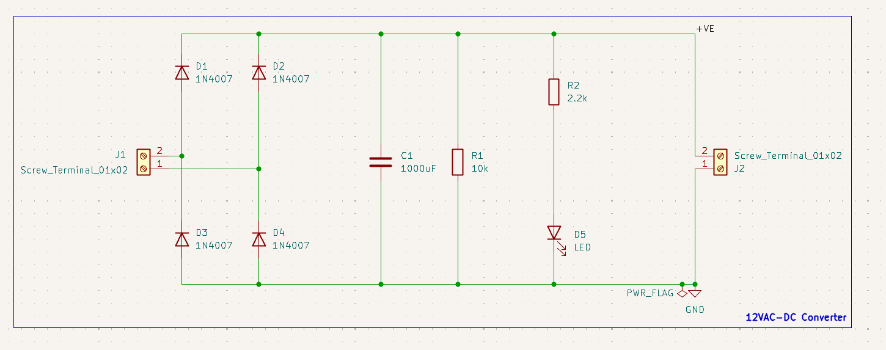
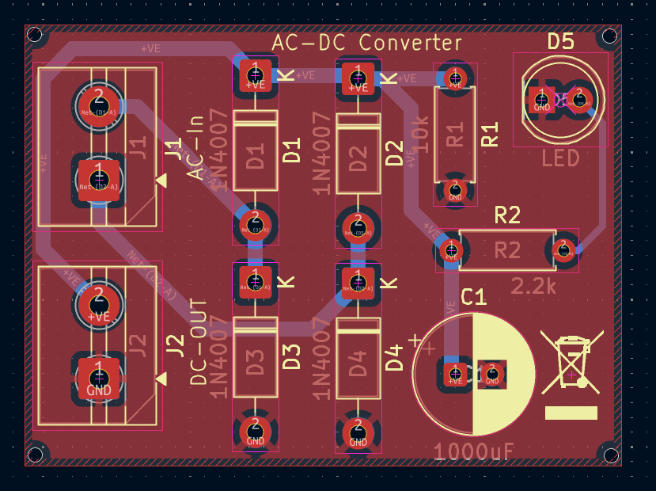
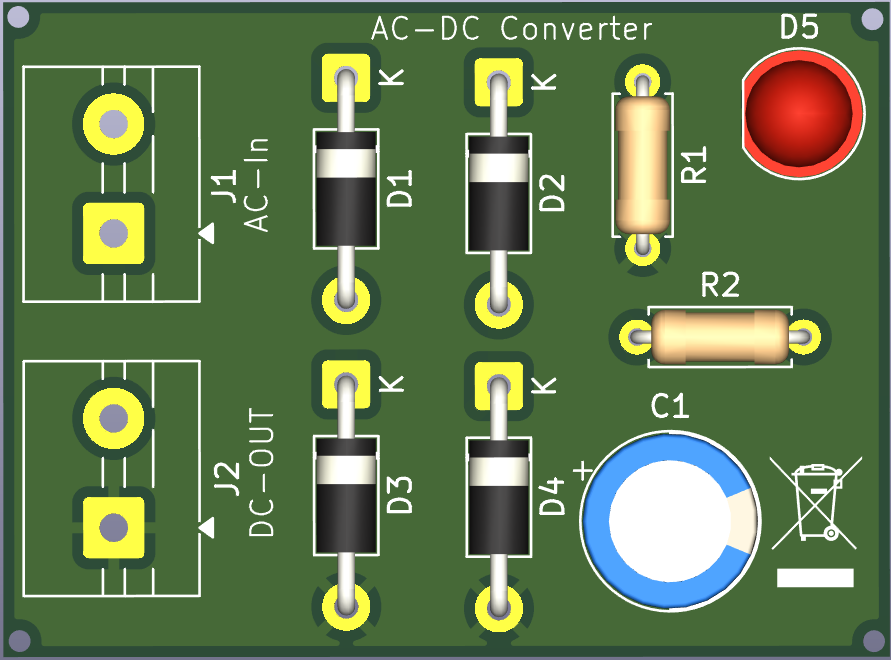

# 12V AC to DC Converter

A low-voltage AC-to-DC power supply PCB designed and developed in KiCad.

## Overview

This project is a 12V AC to DC converter designed as a practical PCB design project. The circuit uses a full-wave bridge rectifier followed by a 1000µF smoothing capacitor to convert the AC input into filtered DC.

The board also includes a 10kΩ bleeder resistor for the filter capacitor and a 2.2kΩ resistor with an LED for power indication.

## Features

- 12V AC input
- Full-wave bridge rectifier
- 4 × 1N4007 diodes
- 1000µF smoothing capacitor
- 10kΩ bleeder resistor
- 2.2kΩ LED current-limiting resistor
- Power indicator LED
- Screw-terminal input and output
- KiCad schematic and PCB layout
- PCB Design Rule Check

## Schematic

## PCB

## 3D View

## Components

| Reference | Component | Value |
|---|---|---|
| D1–D4 | Rectifier Diodes | 1N4007 |
| C1 | Electrolytic Capacitor | 1000µF |
| R1 | Bleeder Resistor | 10kΩ |
| R2 | LED Resistor | 2.2kΩ |
| D5 | LED | Power Indicator |
| J1 | Screw Terminal | AC Input |
| J2 | Screw Terminal | DC Output |

## Working Principle

The 12V AC input is converted into pulsating DC through the four-diode full-wave bridge rectifier. The 1000µF capacitor then smooths the rectified waveform and reduces the output ripple.

The 10kΩ resistor provides a discharge path for the filter capacitor, while the LED provides a visual indication that the DC rail is energized.

## PCB Design

The PCB was designed completely in KiCad, including schematic capture, footprint assignment, component placement, routing, and design-rule verification.

The design process was:

**Schematic → Components → Footprints → PCB Placement → Routing → DRC → Final PCB**

## Learning Objectives

This project was created to gain practical experience with:

- AC-to-DC conversion
- Bridge rectification
- Capacitor filtering
- Component selection
- Schematic design
- Footprint selection
- PCB placement
- Power routing
- Ground routing
- PCB Design Rule Checking
- KiCad workflow

## Project Status

- [x] Schematic completed
- [x] Components selected
- [x] Footprints assigned
- [x] PCB layout completed
- [x] Routing completed
- [x] DRC completed
- [ ] PCB manufactured
- [ ] Hardware assembled
- [ ] Hardware tested

## Future Improvements

- Add voltage regulation
- Add over-current protection
- Add short-circuit protection
- Add additional output filtering
- Add dedicated test points
- Perform load and ripple measurements

## Tools

- KiCad
- KiCad Schematic Editor
- KiCad PCB Editor
- KiCad 3D Viewer

## Safety

This project is intended for use with a suitable low-voltage 12V AC source.

**Do not connect the input directly to mains voltage.**

## Author

**Santanu Jha**

Embedded Systems | Electronics | PCB Design
